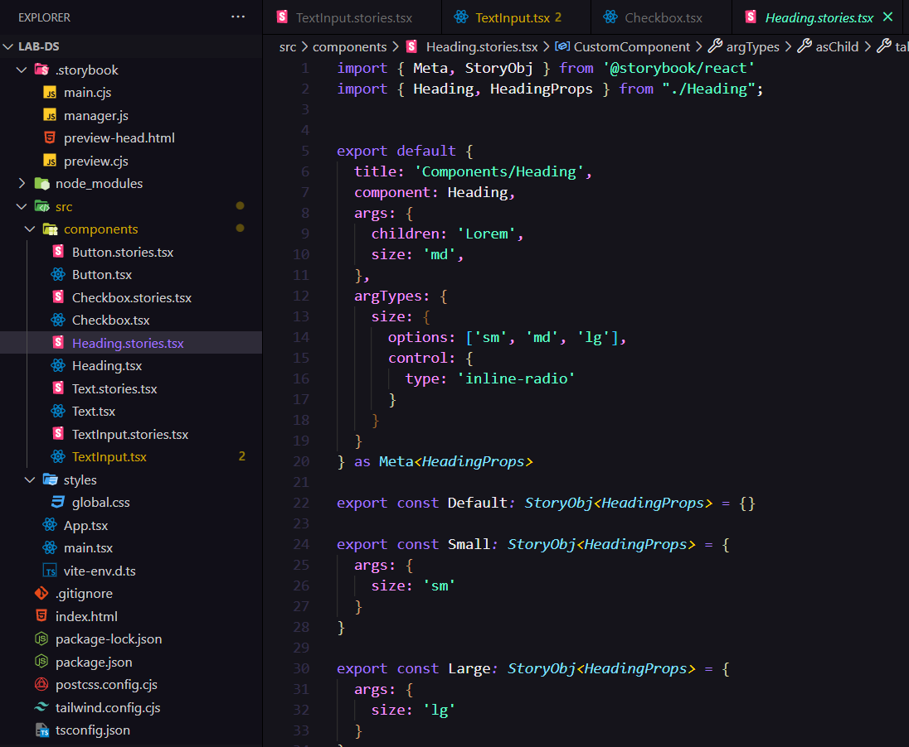

# Lab Design System

    

> Trilha Ignite

Design System desenvolvido utilizando vários recursos da tecnologia Storybook para a documentação da aplicação, foi feito a automatização de atualizações dos componentes no Storybook quando outros futuramentes forem adicionados utilizando a tecnlogia Github Actions com CI e CD

Storybook Design System developed for future application documentation, updates of components in Storybook were automated when other resources added using Github Actions technology with CI and CD

Storybook App --> https://lucadboer.github.io/LAB-Design-System/

## 🛠 Technologies

- Storybook
- React
- TypeScript
- TailwindCSS
- Radix UI
- Github Pages

## 🧑‍💻 Applications

- Design System
- Components React
- Typing with typescript
- Radix UI Components 
- CI e CD DevOps

## 💛 Contact

- Email --> luca.boer@outlook.com
- Linkedin --> https://www.linkedin.com/in/luca-destefano-boer-99674121b/
